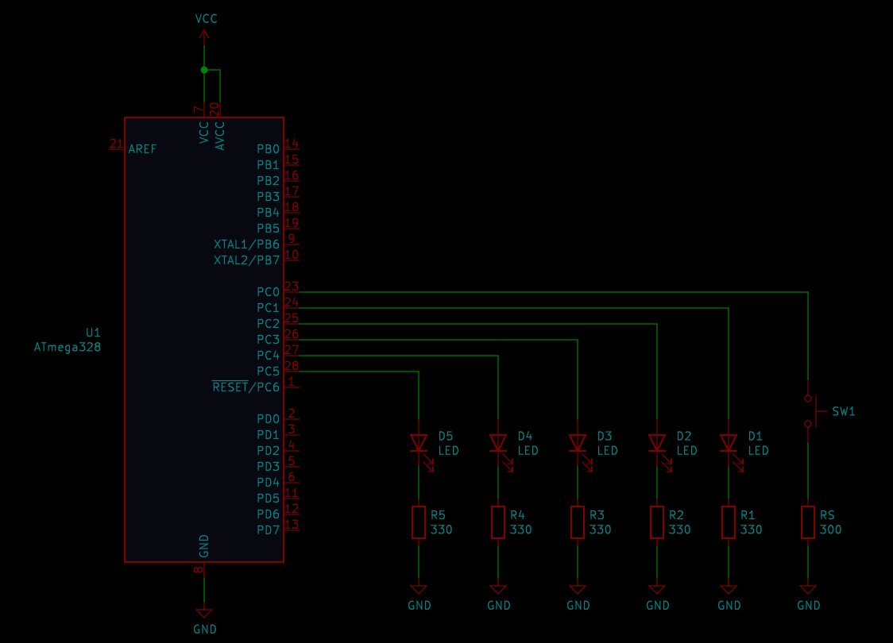

# Lab 2: Ondřej Dudášek

Link to your `Digital-electronics-2` GitHub repository:

   [https://github.com/digital-electronics-2](https://github.com/digital-electronics-2)


### Active-low and active-high LEDs

1. Complete tables according to the AVR manual.

| **DDRB** | **Description** |
| :-: | :-- |
| 0 | Input pin  | 
| 1 | Output pin |

| **PORTB** | **Description** |
| :-: | :-- |
| 0 | Output low value |
| 1 | Output high walue|

| **DDRB** | **PORTB** | **Direction** | **Internal pull-up resistor** | **Description** |
| :-: | :-: | :-: | :-: | :-- |
| 0 | 0 | input  | no | Tri-state, high-impedance |
| 0 | 1 | input  | yes | Input with internal pull up |
| 1 | 0 | output | no | Output low |
| 1 | 1 | output | no | Output high |

2. Part of the C code listing with syntax highlighting, which blinks alternately with a pair of LEDs; let one LED is connected to port B and the other to port C:

```c
int main(void)
{
    // Led port setup
    DDRC = DDRC | (1<<LED_RED);
    DDRB = DDRB | (1<<LED_GREEN);
 

    while (1)
    {
        LED_RED_ON();
        LED_GREEN_OFF();
        _delay_ms(500);
        
        LED_RED_OFF();
        LED_GREEN_ON();
        _delay_ms(500);

    }

    return 0;
}
```


### Push button

1. Part of the C code listing with syntax highlighting, which toggles LEDs only if push button is pressed. Otherwise, the value of the LEDs does not change. Let the push button is connected to port D:

```c

int main(void)
{
    // Led port setup
    DDRC = DDRC | (1<<LED_RED);
    DDRB = DDRB | (1<<LED_GREEN);

    // Button port setup
    DDRC = DDRC & ~(1<<BUTTON);
    PORTC = PORTC | (1<<BUTTON);    

    while (1)
    {
        loop_until_bit_is_clear(PINC, BUTTON);

        LED_RED_ON();
        LED_GREEN_OFF();
        _delay_ms(500);

        loop_until_bit_is_clear(PINC, BUTTON);

        
        LED_RED_OFF();
        LED_GREEN_ON();
        _delay_ms(500);

    }

    return 0;
}
```


### Knight Rider

   
