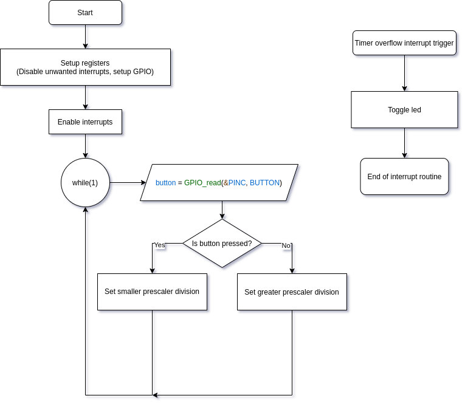
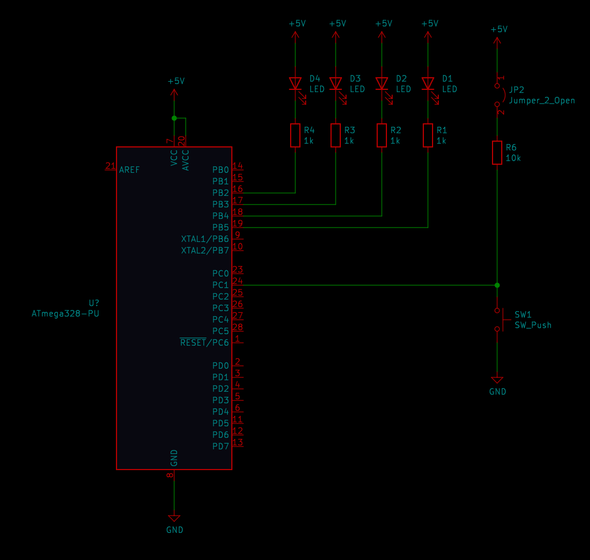

# Lab 4: Ondrej Dudasek

Link to your `Digital-electronics-2` GitHub repository:

   [https://github.com/ondrejdudasek/digital-electronics-2](https://github.com/ondrejdudasek/digital-electronics-2)


## Overflow times

|         Module        |   Number of bits  |   1   |   8   |   32  |   64  |  128  |  256  |  1024  |
|          :=:          |         :=:       |  :=:  |  :=:  |  :=:  |  :=:  |  :=:  |  :=:  |   :=:  |
|    Timer/Counter 0    |          8        |  16u  |  128u |  512u | 1024u | 2048u | 4096u | 16384u |
|    Timer/Counter 1    |          16       | 4096u | 32.768m | 131.072m | 262.144m | 524.288m | 1.048576s | 4.194304s | 
|    Timer/Counter 2    |          8        |  16u  |  128u |  512u | 1024u | 2048u | 4096u | 16384u |

## Timer library

1. In your words, describe the difference between common C function and interrupt service routine.
   * Function is called by main() or any other function during normal operation. 
   * Interrupt service routine is called after interrupt flag is raised, pausing main code during it's execution. 


2. Part of the header file listing with syntax highlighting, which defines settings for Timer/Counter0:

```c
/**
 * @brief Defines prescaler CPU frequency values for Timer/Counter1.
 * @note  F_CPU = 16 MHz
 */

#define TIM0_stop()              TCCR0B &= ~((1<<CS12) | (1<<CS11) | (1<<CS10));          // 000 --> STOP
#define TIM0_overflow_16us()     TCCR0B &= ~((1<<CS12) | (1<<CS11)); TCCR0B |= (1<<CS10); // 001 --> 1
#define TIM0_overflow_128us()    TCCR0B &= ~((1<<CS12) | (1<<CS10)); TCCR0B |= (1<<CS11); // 010 --> 8
#define TIM0_overflow_512us()    TCCR0B &= ~(1<<CS12);               TCCR0B |= (1<<CS11) | (1<<CS10);  // 011 --> 64
#define TIM0_overflow_1024us()   TCCR0B &= ~((1<<CS11) | (1<<CS10)); TCCR0B |= (1<<CS12); // 100 --> 256
#define TIM0_overflow_2048us()   TCCR0B &= ~(1<<CS11);               TCCR0B |= (1<<CS12) | (1<<CS10);  // 101 --> 1024
#define TIM0_overflow_4096us()
#define TIM0_overflow_1us()
```

3. Flowchart figure for function `main()` and interrupt service routine `ISR(TIMER1_OVF_vect)` of application that ensures the flashing of one LED in the timer interruption. When the button is pressed, the blinking is faster, when the button is released, it is slower. Use only a timer overflow and not a delay library. The image can be drawn on a computer or by hand. Use clear descriptions of the individual steps of the algorithms.

   


### Knight Rider

1. Scheme of Knight Rider application with four LEDs and a push button, connected according to Multi-function shield. Connect AVR device, LEDs, resistors, push button, and supply voltage. The image can be drawn on a computer or by hand. Always name all components and their values.

   
